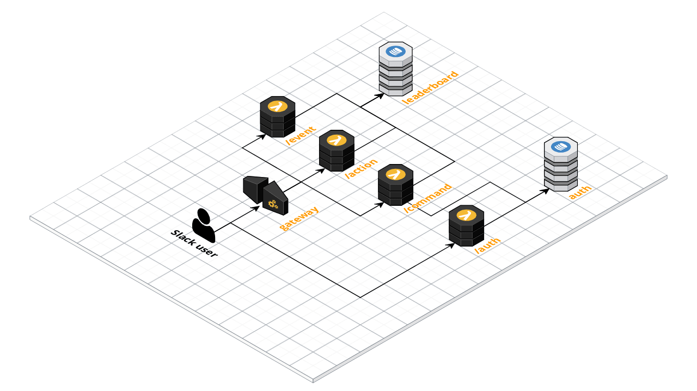

# buddybot

A buddy friendly Slack bot

* Recognise fellow members with PlusPlus points
* View the recognition leaderboard
* Flag messages for admin attention

We use a development Slack workspace to avoid noise in active Slack communities. You can find us here: [buddybotdev.slack.com](https://buddybotdev.slack.com/)

## Overview

Buddybot runs on AWS Lamda. An overview of the set-up is below.

## Build

We are working on documenting a build process.

## Test

We are working on documenting a local test process.

## Deploy

We are working on documenting a deployment process.

# Use

The following is for testing purposes only and should not be used on production Slack workspaces.

